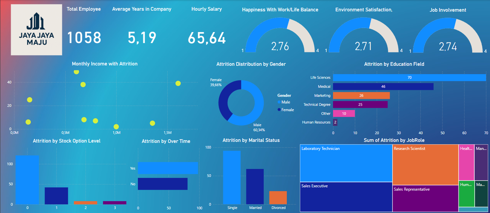

# 📊 Analisis Attrition Karyawan dengan XGBoost & SHAP

## 🎯 Tujuan Proyek

Proyek ini bertujuan untuk membantu tim HRD perusahaan **Jaya Jaya Maju** dalam memahami bagaimana faktor-faktor seperti jabatan, pengalaman kerja, kondisi lingkungan, dan beban kerja memengaruhi **attrition rate** (tingkat pengunduran diri) karyawan. 

Dengan memanfaatkan model **XGBoost** dan teknik interpretasi seperti **Feature Importance** dan **SHAP**, tim dapat mengidentifikasi fitur yang paling mempengaruhi keputusan karyawan untuk resign.

---

## 🔍 Analisis Feature Importance & SHAP

### 1. Global Feature Importance (SHAP Values)

#### ✅ Fitur Paling Dominan:
- **StockOptionLevel**  
  → Karyawan dengan opsi saham rendah cenderung lebih mungkin resign.
- **EnvironmentSatisfaction**  
  → Kepuasan lingkungan kerja yang rendah meningkatkan risiko resign.
- **OverTime_Yes**  
  → Karyawan yang sering lembur memiliki risiko resign lebih tinggi.
- **JobInvolvement**  
  → Keterlibatan rendah dalam pekerjaan berkorelasi dengan peningkatan attrition.

#### 🧠 Interpretasi Bisnis:
- Evaluasi ulang kebijakan terkait **opsi saham**, **lingkungan kerja**, dan **lembur** untuk mencegah attrition.

---

### 2. SHAP Summary Plot (Analisis Multivariat)

#### 📌 Dampak Fitur pada Prediksi:
- **OverTime_Yes**  
  → Titik merah (nilai tinggi) di sebelah kanan menunjukkan karyawan lembur lebih berisiko resign.
- **EnvironmentSatisfaction**  
  → Nilai SHAP negatif dari kepuasan rendah menunjukkan potensi resign tinggi.
- **StockOptionLevel**  
  → Semakin rendah opsi saham (warna biru), semakin tinggi risiko resign.

#### 📚 Pola Menarik:
- **EducationField_Life Sciences / Medical**  
  → Cenderung lebih stabil (nilai SHAP negatif).
- **MaritalStatus_Divorced**  
  → Cenderung meningkatkan risiko resign.
- **MaritalStatus_Married**  
  → Cenderung mengurangi risiko resign.

---

### 3. Feature Importance dari Model

#### 📌 Konsistensi dengan SHAP:
- Fitur utama tetap: **StockOptionLevel**, **EnvironmentSatisfaction**, **OverTime_Yes**.

#### 🔄 Perbedaan:
- **JobRole_Manufacturing Director** muncul sebagai penting di feature importance tapi tidak di SHAP, menunjukkan adanya interaksi kompleks dalam model.

#### 💡 Fitur Lain yang Relevan:
- **WorkLifeBalance**  
  → Keseimbangan kerja-hidup yang buruk meningkatkan risiko resign.
- **JobSatisfaction**  
  → Kepuasan kerja rendah berkontribusi terhadap keputusan resign.

---

## 🧾 Kesimpulan

### Faktor Utama Penyebab Resign:

1. **Kebijakan Kompensasi**
   - **StockOptionLevel** & **JobLevel** rendah menunjukkan karyawan merasa kurang dihargai.

2. **Beban Kerja**
   - **OverTime** & **JobInvolvement** rendah menandakan beban kerja tidak seimbang.

3. **Lingkungan Kerja**
   - **EnvironmentSatisfaction** & **JobSatisfaction** rendah mencerminkan budaya kerja yang perlu evaluasi.

4. **Faktor Demografi**
   - Karyawan dengan **MaritalStatus_Divorced** dan **Gender_Female** cenderung lebih rentan resign *(tergantung konteks data)*.

---

## ✅ Rekomendasi untuk HR

1. **Tingkatkan Kepuasan Lingkungan Kerja**  
   - Laksanakan program feedback rutin dari karyawan.  
   - Lakukan perbaikan dan pemeliharaan fasilitas kerja secara berkala.

2. **Batasi Overtime**  
   - Evaluasi ulang distribusi beban kerja antar tim.  
   - Sediakan insentif yang adil untuk lembur.

3. **Review Kebijakan Kompensasi**  
   - Tawarkan opsi saham atau tunjangan tambahan, terutama untuk karyawan level junior.

4. **Fleksibilitas Kerja**  
   - Terapkan program kerja dari rumah (WFH) sebagian atau penuh waktu.  
   - Dorong keseimbangan kehidupan kerja (Work-Life Balance) untuk meningkatkan produktivitas.

---

## 📊 Dashboard Visualisasi

Berikut adalah tampilan dashboard interaktif yang dibuat untuk membantu tim HR menganalisis faktor penyebab attrition:

---

